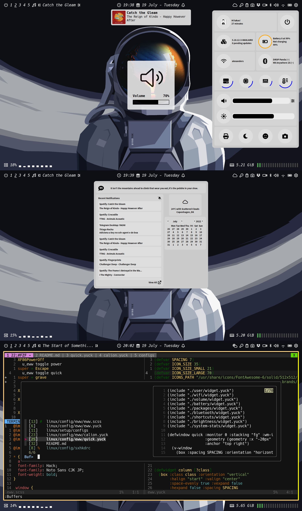

# Dotfiles

This is a collection of configurations and customizations I've hoarded,
throughout the years, in order to tweak my various desktops into
supporting my preferred workflows.

## Information



* Operating System is [Arch Linux](https://archlinux.org/);
* Window Management is handled by [i3wm](https://github.com/Airblader/i3);
* Top & Bottom bars are built with [Polybar](https://github.com/polybar/polybar);
* Widgets are built with [Eww](https://github.com/elkowar/eww);
* Notifications are provided by [Wired](https://github.com/Toqozz/wired-notify);
* Window decoration and animations are from [Picom](https://github.com/yshui/picom);
* Wallpapers are by the talented [Byrotek](https://www.patreon.com/byrotek);
* Application Launcher is [rofi](https://github.com/davatorium/rofi);
* Code editing using [NeoVim](https://neovim.io/).

## Installation

Configuration is done through symlinks and relative paths.

```sh
$ git clone git@github.com:lukelex/dotfiles.git
$ cd dotfiles && ./linux/install/all
```
