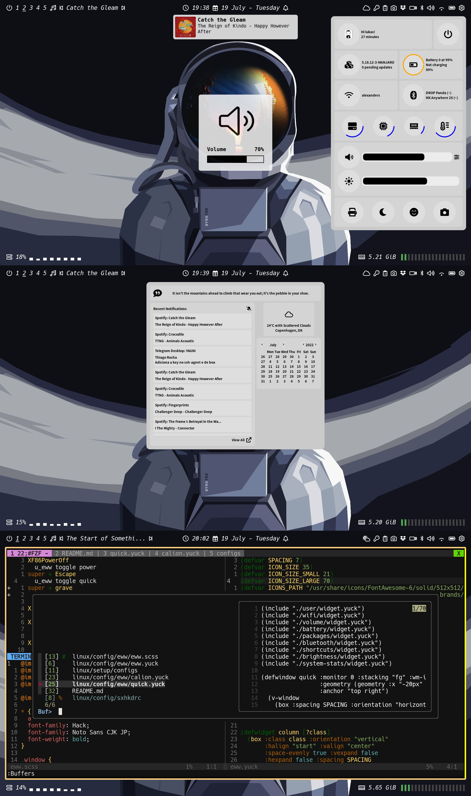

# Dotfiles

This is a collection of configurations and customizations I've hoarded,
throughout the years, in order to tweak my various desktops into
supporting my preferred workflows.

## Information



- Operating System is [Arch Linux](https://archlinux.org/);
- Window Management is handled by [Hyprland](https://github.com/hyprwm/Hyprland);
- Top & Bottom bars are built with [Polybar](https://github.com/polybar/polybar);
- Widgets are built with [Eww](https://github.com/elkowar/eww);
- Notifications are provided by [Wired](https://github.com/Toqozz/wired-notify);
- Window decoration and animations are from [Picom](https://github.com/yshui/picom);
- Wallpapers are by the talented [Byrotek](https://www.patreon.com/byrotek);
- Application Launcher is [rofi](https://github.com/davatorium/rofi);
- Code editing using [NeoVim](https://neovim.io/).

## Installation

Configuration is done through symlinks and relative paths.

```sh
$ git clone --recurse-submodules git@github.com:lukelex/dotfiles.git
$ cd dotfiles && ./linux/install/sync
```

For a headless homelab server, run `./linux/install/sync --server`. The legacy
`all` command is retained as a compatibility wrapper for `sync`.
Profile packages, groups, and services are defined in
`linux/packages.yaml` and parsed by the bundled static `yq` binary.
The `common` section applies to every profile; profile sections contain only
their additions. The root `source: aur` makes `yay` the default resolver; it
also resolves official repository packages. A package can override this with a
`source` child when needed. Package values can list Unix groups required by
that package.
Packages can also declare repository-to-target config links, such as
`linux/config/nvim:$XDG_CONFIG_HOME/nvim`.
The first interactive desktop sync records its package selections locally. Use a
committed `linux/hosts/<name>.yaml` overlay with `--host <name>` for additional
machine-specific package metadata. See `linux/hosts/README.md` for the overlay
format.

Run `./linux/install/all --dry-run` to preview every action without touching
the system. The config stage skips links that would overwrite existing files;
pass `--replace` (e.g. `./linux/install/configs --replace`) to overwrite them.

Run `./linux/install/sync --server` (or `--desktop`) to reconcile a profile.
Each package, group, service, and config-link stage requires confirmation.
Only resources previously recorded under `$XDG_STATE_HOME/dotfiles/install` are
eligible for removal.

Run `./linux/install/package validate [--host <name>]` to verify selected
manifest packages. Repository packages use local pacman sync databases and AUR
packages use batched AUR RPC requests.

Existing package metadata remains supported: `groups`, `configs`, and
`services` declared on package entries are reconciled by the standalone sync.
Use top-level `resources.configs` and `resources.services` for custom resources
that are not owned by a package.

Package-specific operations use `./linux/install/package`: run `package sync`
to reconcile only packages, `package validate` to check the manifest, or
`package add <name>` to declare, validate, install, and track a package. The
add command prompts for a manifest scope unless `--scope` is provided.
