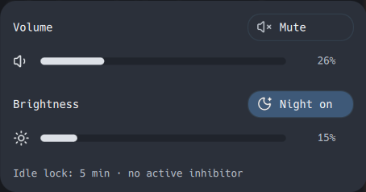
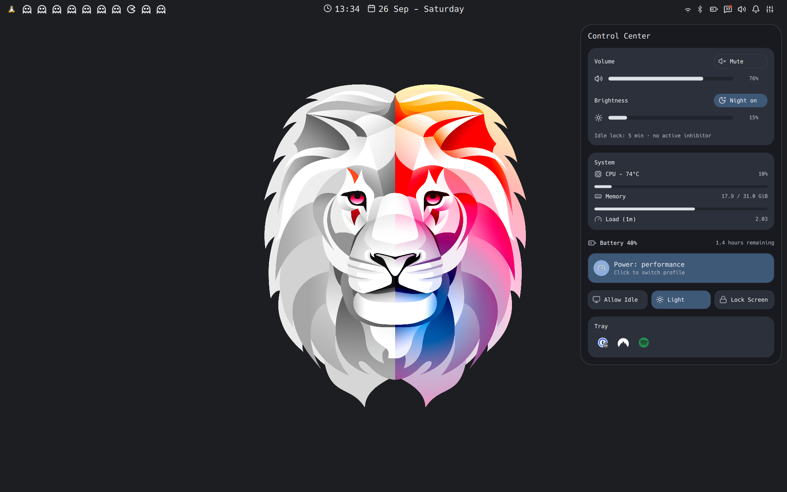
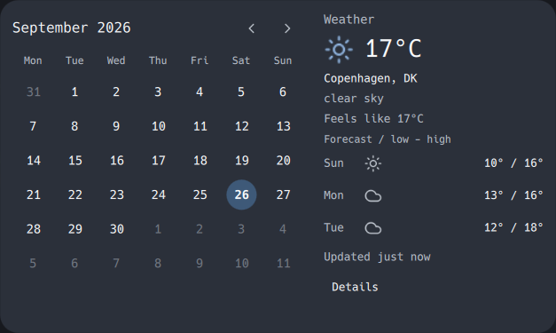
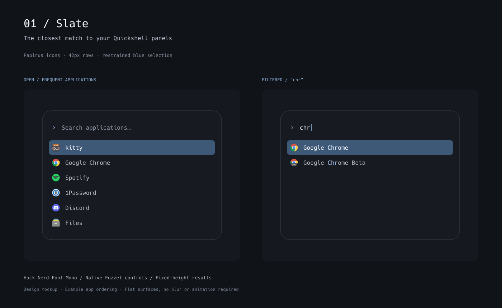
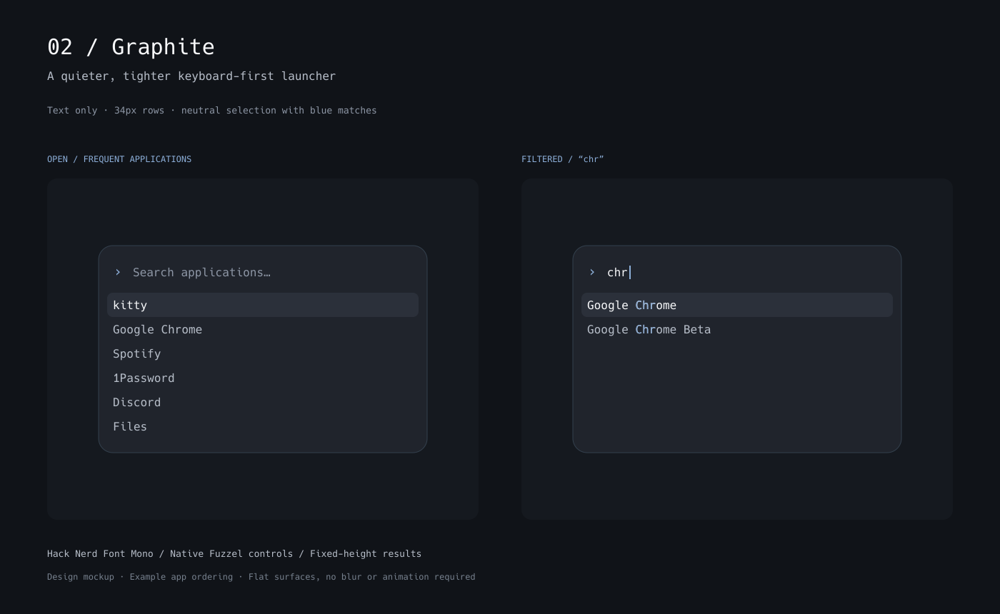
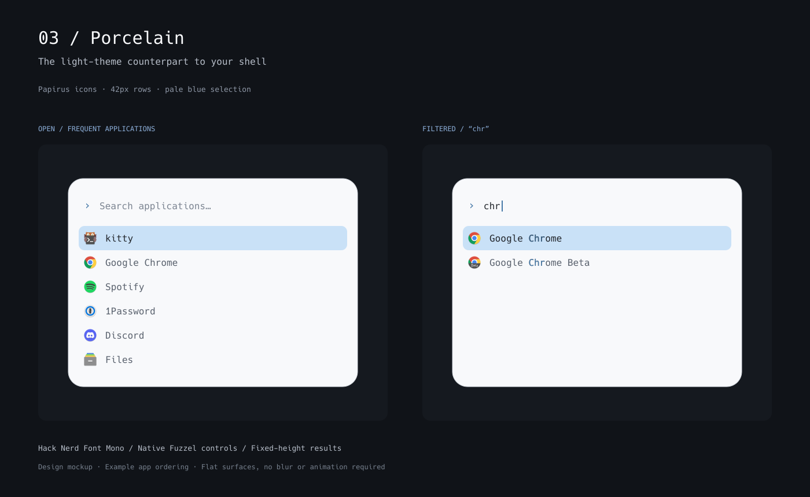

<div align="center">

<h1>Dotfiles</h1>

<h3>A considered Linux desktop, built around the way I work.</h3>

<p>Arch Linux · Hyprland / i3 · Quickshell · Neovim</p>

<p><a href="#desktop">Desktop setup</a> · <a href="#screenshots">Screenshots</a> · <a href="#install">Install</a> · <a href="#repository-guide">Repository guide</a></p>

</div>

<br>

<p align="center"><a href="screenshots/desktop.png"></a></p>

## Desktop

| Component | Setup |
| --- | --- |
| **Window managers** | [Hyprland](https://github.com/hyprwm/Hyprland) on Wayland · [i3](https://i3wm.org/) on X11 |
| **Desktop shell** | [Quickshell](https://quickshell.outfoxxed.me/) bar, panels, notifications, and OSDs |
| **Launchers** | [Fuzzel](https://codeberg.org/dnkl/fuzzel) on Hyprland · [rofi](https://github.com/davatorium/rofi) on i3 |
| **Compositor** | Hyprland effects · [Picom](https://github.com/yshui/picom) for i3 |
| **Editor** | [Neovim](https://neovim.io/) with lazy.nvim |

The configs favor a quiet status surface, quick keyboard workflows, and panels
that reveal detail only when needed. Shared helpers keep the Hyprland and i3
setups familiar across Wayland and X11.

## Screenshots

<table>
  <tr>
    <td width="50%">
      <a href="screenshots/control-center.png"></a>
      <p align="center"><sub>Quickshell · Control Center</sub></p>
    </td>
    <td width="50%">
      <a href="screenshots/calion.png"></a>
      <p align="center"><sub>Quickshell · Calendar and weather</sub></p>
    </td>
  </tr>
</table>

### Fuzzel themes

Three launcher palettes, including a light theme. These are design previews of
the launcher configuration.

<table>
  <tr>
    <td width="33%"><a href="designs/fuzzel/01-slate.png"></a><p align="center"><sub>Slate · default</sub></p></td>
    <td width="33%"><a href="designs/fuzzel/02-graphite.png"></a><p align="center"><sub>Graphite · compact</sub></p></td>
    <td width="33%"><a href="designs/fuzzel/03-porcelain.png"></a><p align="center"><sub>Porcelain · light</sub></p></td>
  </tr>
</table>

## Install

The desktop configuration expects the repository at **`$HOME/dotfiles`** on
Arch Linux.

```sh
git clone --recurse-submodules git@github.com:lukelex/dotfiles.git "$HOME/dotfiles"
cd "$HOME/dotfiles"
./linux/install/sync
```

For a headless server, use `./linux/install/all --server`. For a specific
machine, pass a committed host overlay, for example:

```sh
./linux/install/sync --host <name>
```

## Repository guide

- [`linux/packages.yaml`](linux/packages.yaml) — desktop and server package selections, config links, and services.
- [`linux/install/`](linux/install/) — sync, full setup, verification, and supporting installer steps.
- [`linux/config/`](linux/config/) — application and desktop configurations.
- [`linux/scripts/`](linux/scripts/) — system helpers, installed as `u_*` commands on desktop setups.
- [`linux/hosts/README.md`](linux/hosts/README.md) — host overlay format.
- [`linux/config/fuzzel/README.md`](linux/config/fuzzel/README.md) — launcher themes and shortcuts.

<details>
<summary><strong>How installation works</strong></summary>

`sync` reconciles packages, groups, config links, and services from the selected
profile using the pinned `dotpkg` binary. On first use, it seeds
`$XDG_CONFIG_HOME/dotpkg/package.yaml` from `linux/packages.yaml`; dotpkg stores
its state beside that manifest.

Preview the reconciliation with:

```sh
./linux/install/sync --dry-run
```

The first run can still bootstrap `yay` and initialize dotpkg's local manifest
and state. Existing installs keep their local manifest; use
`--refresh-manifest` to adopt the repository version (a backup is saved beside
it). Config conflicts are preserved unless `--replace` is passed. Use
`./linux/install/all` to include system setup, post-install steps, and
verification, or `./linux/install/verify` to check an existing setup.

For package and resource maintenance, see `dotpkg --help`. `dotpkg clean` only
removes stale managed packages; `dotpkg recover` handles an interrupted
transaction.

</details>
